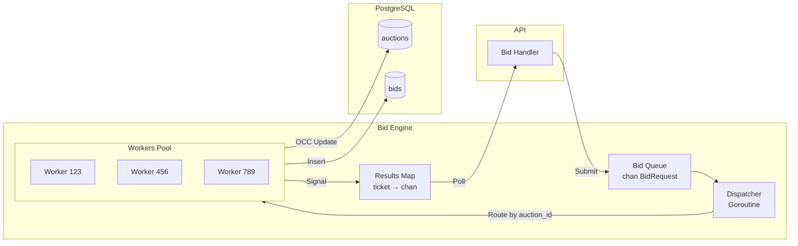

# Backend Onboarding Guide

Welcome to the Vehicle Auction Platform Go backend! This guide covers everything you need to contribute effectively.

---

## Quick Start

```bash
# From project root

# 1. Start infrastructure
make docker-up

# 2. Run migrations
make migrate

# 3. Start the server
make run

# Server runs on http://localhost:8080
```

**Verify it's working:**
```bash
curl http://localhost:8080/health
# {"status":"healthy","checks":{"database":"healthy"}}
```

---

## Architecture Overview

```mermaid
flowchart TB
    subgraph entry [Entry Point]
        Main[cmd/server/main.go]
    end

    subgraph middleware [Middleware Chain]
        Recovery[Recovery]
        RequestID[Request ID]
        Tracing[OpenTelemetry]
        Logging[slog JSON]
        CORS[CORS]
        Auth[Clerk JWT Auth]
    end

    subgraph handlers [HTTP Handlers]
        direction LR
        H1[Vehicle]
        H2[Auction]
        H3[Bid]
        H4[Auth]
        H5[SSE]
        H6[Watchlist]
        H7[Notification]
        H8[Image]
        H9[VIN]
        H10[Health]
        H11[Debug]
    end

    subgraph core [Core Components]
        BidEngine[Bid Engine<br/>Goroutines + Channels]
        SSEBroker[SSE Broker<br/>Fan-out]
        Repo[Repository<br/>sqlc generated]
    end

    subgraph infra [Infrastructure]
        PG[(PostgreSQL)]
        Redis[(Redis)]
        S3[S3]
        Clerk[Clerk]
        Jaeger[Jaeger]
        Sentry[Sentry]
    end

    Main --> middleware
    middleware --> handlers
    handlers --> core
    core --> infra
```



---

## Project Structure

```
vehicle-auc/
├── cmd/server/
│   └── main.go              # Entry point, wire everything
│
├── internal/
│   ├── bidengine/           # Bid processing
│   │   ├── engine.go        # Queue + dispatcher
│   │   ├── worker.go        # Per-auction workers
│   │   ├── processor.go     # OCC logic
│   │   ├── errors.go        # Custom errors
│   │   └── engine_test.go   # Unit tests
│   │
│   ├── config/
│   │   └── config.go        # Env var loading
│   │
│   ├── domain/
│   │   └── types.go         # Shared types (BidEvent, etc.)
│   │
│   ├── handler/
│   │   ├── auctions.go
│   │   ├── auth.go
│   │   ├── bids.go
│   │   ├── debug.go
│   │   ├── health.go
│   │   ├── images.go
│   │   ├── notifications.go
│   │   ├── sse.go
│   │   ├── vehicles.go
│   │   ├── vin.go
│   │   └── watchlist.go
│   │
│   ├── metrics/
│   │   └── metrics.go       # Prometheus metrics
│   │
│   ├── middleware/
│   │   ├── auth.go          # Clerk JWT validation
│   │   ├── logging.go       # Request logging
│   │   ├── requestid.go     # X-Request-ID
│   │   ├── tracing.go       # OpenTelemetry spans
│   │   └── middleware_test.go
│   │
│   ├── realtime/
│   │   ├── broker.go        # SSE broker
│   │   └── broker_test.go
│   │
│   ├── repository/
│   │   └── queries/         # SQL files for sqlc
│   │       ├── users.sql
│   │       ├── vehicles.sql
│   │       ├── auctions.sql
│   │       ├── bids.sql
│   │       ├── watchlist.sql
│   │       └── notifications.sql
│   │
│   └── tracing/
│       └── tracing.go       # OpenTelemetry setup
│
├── migrations-go/
│   ├── 001_initial_schema.up.sql
│   └── 001_initial_schema.down.sql
│
├── tests/
│   ├── fixtures/
│   │   ├── db.go            # Test DB setup
│   │   └── fixtures.go      # Test data helpers
│   └── integration/
│       ├── auctions_test.go
│       ├── auth_test.go
│       ├── bids_test.go
│       ├── health_test.go
│       ├── images_test.go
│       ├── notifications_test.go
│       ├── vehicles_test.go
│       ├── vin_test.go
│       └── watchlist_test.go
│
├── go.mod
├── go.sum
├── sqlc.yaml
├── Makefile
├── Dockerfile
└── docker-compose.yml
```

---

## Key Concepts

### 1. Handler Pattern

Handlers are HTTP endpoint implementations. Each handler struct holds its dependencies:

```go
// internal/handler/vehicles.go
type VehicleHandler struct {
    db     *pgxpool.Pool
    logger *slog.Logger
}

func NewVehicleHandler(db *pgxpool.Pool, logger *slog.Logger) *VehicleHandler {
    return &VehicleHandler{db: db, logger: logger}
}

func (h *VehicleHandler) ListVehicles(w http.ResponseWriter, r *http.Request) {
    ctx := r.Context()
    
    // Parse query params
    limit := parseIntOr(r.URL.Query().Get("limit"), 20)
    offset := parseIntOr(r.URL.Query().Get("offset"), 0)
    
    // Query database
    rows, err := h.db.Query(ctx, `
        SELECT id, vin, year, make, model, starting_price
        FROM vehicles
        WHERE status = 'approved'
        ORDER BY created_at DESC
        LIMIT $1 OFFSET $2
    `, limit, offset)
    if err != nil {
        h.jsonError(w, "database error", http.StatusInternalServerError)
        return
    }
    defer rows.Close()
    
    // Scan and return
    var vehicles []Vehicle
    for rows.Next() {
        var v Vehicle
        rows.Scan(&v.ID, &v.VIN, &v.Year, &v.Make, &v.Model, &v.StartingPrice)
        vehicles = append(vehicles, v)
    }
    
    h.jsonResponse(w, vehicles, http.StatusOK)
}
```

### 2. Middleware

Middleware wraps handlers to add cross-cutting concerns:

```go
// internal/middleware/logging.go
func Logging(logger *slog.Logger) func(http.Handler) http.Handler {
    return func(next http.Handler) http.Handler {
        return http.HandlerFunc(func(w http.ResponseWriter, r *http.Request) {
            start := time.Now()
            
            // Wrap response writer to capture status
            ww := &responseWriter{ResponseWriter: w, status: 200}
            
            // Call next handler
            next.ServeHTTP(ww, r)
            
            // Log request
            logger.Info("http_request",
                slog.String("method", r.Method),
                slog.String("path", r.URL.Path),
                slog.Int("status", ww.status),
                slog.Duration("duration", time.Since(start)),
                slog.String("request_id", GetRequestID(r.Context())),
            )
        })
    }
}
```

**Middleware order matters!** In `main.go`:

```go
r := chi.NewRouter()
r.Use(chimw.Recoverer)      // 1. Catch panics
r.Use(middleware.RequestID) // 2. Generate request ID
r.Use(middleware.Tracing)   // 3. Start trace span
r.Use(middleware.Logging)   // 4. Log requests
r.Use(cors.Handler(...))    // 5. CORS headers
```

### 3. Bid Engine

The bid engine processes bids asynchronously using goroutines:



**Key files:**
- `engine.go` - Queue and dispatcher
- `worker.go` - Per-auction worker goroutine
- `processor.go` - OCC update logic

### 4. OCC (Optimistic Concurrency Control)

We use a `version` column to detect concurrent modifications:

```go
// internal/bidengine/processor.go
func (p *Processor) ProcessBid(ctx context.Context, req BidRequest) (*BidResult, error) {
    for attempt := 0; attempt < p.maxRetries; attempt++ {
        // 1. Read current state
        var currentBid decimal.Decimal
        var version int
        err := p.db.QueryRow(ctx, `
            SELECT current_bid, version 
            FROM auctions 
            WHERE id = $1 AND status = 'active'
        `, req.AuctionID).Scan(&currentBid, &version)
        if err != nil {
            return nil, ErrAuctionNotFound
        }

        // 2. Validate bid
        if req.Amount.LessThanOrEqual(currentBid) {
            return &BidResult{Status: "rejected", Reason: "bid too low"}, nil
        }

        // 3. Attempt OCC update
        result, err := p.db.Exec(ctx, `
            UPDATE auctions
            SET current_bid = $1, 
                current_bid_user_id = $2,
                bid_count = bid_count + 1,
                version = version + 1
            WHERE id = $3 AND version = $4
        `, req.Amount, req.UserID, req.AuctionID, version)
        
        if result.RowsAffected() == 0 {
            // Version mismatch - someone else updated, retry
            time.Sleep(p.retryBackoff)
            continue
        }

        // 4. Record bid in history
        p.db.Exec(ctx, `
            INSERT INTO bids (auction_id, user_id, amount, status, previous_high_bid)
            VALUES ($1, $2, $3, 'accepted', $4)
        `, req.AuctionID, req.UserID, req.Amount, currentBid)

        return &BidResult{Status: "accepted"}, nil
    }
    
    return nil, ErrMaxRetriesExceeded
}
```

### 5. SSE Broker

The SSE broker manages client connections and broadcasts events:

```go
// internal/realtime/broker.go
type Broker struct {
    subscribers map[int64]map[chan SSEMessage]struct{} // auction_id → clients
    broadcast   chan SSEMessage
    subscribe   chan subscription
    unsubscribe chan subscription
    mu          sync.RWMutex
    logger      *slog.Logger
}

func (b *Broker) Start() {
    go func() {
        for {
            select {
            case sub := <-b.subscribe:
                b.addSubscriber(sub.auctionID, sub.ch)
                
            case sub := <-b.unsubscribe:
                b.removeSubscriber(sub.auctionID, sub.ch)
                
            case msg := <-b.broadcast:
                b.fanOut(msg)
            }
        }
    }()
}

func (b *Broker) Broadcast(msg SSEMessage) {
    b.broadcast <- msg
}
```

---

## Database

### Connecting

We use `pgx` for PostgreSQL:

```go
// In main.go
dbConfig, _ := pgxpool.ParseConfig(cfg.DatabaseURL)
dbConfig.MaxConns = 25
dbConfig.MinConns = 5

db, err := pgxpool.NewWithConfig(ctx, dbConfig)
```

### Queries

Write raw SQL in handlers or use sqlc:

```go
// Raw SQL (simple queries)
var count int
db.QueryRow(ctx, "SELECT COUNT(*) FROM vehicles").Scan(&count)

// sqlc generated (complex queries)
// Define in internal/repository/queries/vehicles.sql:
// -- name: GetVehicleByID :one
// SELECT * FROM vehicles WHERE id = $1;

// Then use generated code:
vehicle, err := queries.GetVehicleByID(ctx, db, vehicleID)
```

### Migrations

SQL files in `migrations-go/`:

```bash
# Apply migrations
make migrate

# Rollback
make migrate-down

# For test database
make migrate-test
```

---

## Authentication

### Clerk JWT Validation

```go
// internal/middleware/auth.go
type ClerkAuth struct {
    jwksURL string
    keySet  jwk.Set
    logger  *slog.Logger
}

func (a *ClerkAuth) Middleware(next http.Handler) http.Handler {
    return http.HandlerFunc(func(w http.ResponseWriter, r *http.Request) {
        // Extract token from Authorization header
        token := extractBearerToken(r)
        if token == "" {
            http.Error(w, "unauthorized", http.StatusUnauthorized)
            return
        }

        // Validate JWT signature using Clerk JWKS
        claims, err := a.validateToken(token)
        if err != nil {
            http.Error(w, "invalid token", http.StatusUnauthorized)
            return
        }

        // Add user info to context
        ctx := context.WithValue(r.Context(), userIDKey, claims.UserID)
        next.ServeHTTP(w, r.WithContext(ctx))
    })
}
```

### Getting User in Handlers

```go
func (h *Handler) MyHandler(w http.ResponseWriter, r *http.Request) {
    userID := middleware.GetUserID(r.Context())
    if userID == 0 {
        // Not authenticated
    }
}
```

---

## Testing

### Unit Tests

Test individual components in isolation:

```go
// internal/bidengine/engine_test.go
func TestBidEngine_ProcessBid_Success(t *testing.T) {
    db := fixtures.SetupTestDB(t)
    logger := slog.New(slog.NewTextHandler(io.Discard, nil))
    broker := realtime.NewBroker(logger)
    
    engine := NewEngine(db, logger, broker, WithSyncMode(true))
    engine.Start()
    defer engine.Stop()

    // Create test data
    userID := fixtures.BuyerUser(t, db)
    vehicleID := fixtures.TestVehicle(t, db, fixtures.SellerUser(t, db))
    auctionID := fixtures.TestAuction(t, db, vehicleID)

    // Submit bid
    err := engine.Submit(BidRequest{
        TicketID:  uuid.New().String(),
        AuctionID: auctionID,
        UserID:    userID,
        Amount:    decimal.NewFromFloat(150.00),
    })
    require.NoError(t, err)

    // Verify auction updated
    var currentBid float64
    db.QueryRow(context.Background(), 
        "SELECT current_bid FROM auctions WHERE id = $1", 
        auctionID,
    ).Scan(&currentBid)
    
    assert.Equal(t, 150.00, currentBid)
}
```

### Integration Tests

Test full HTTP request/response cycles:

```go
// tests/integration/vehicles_test.go
func TestListVehicles(t *testing.T) {
    db := fixtures.SetupTestDBWithMigrations(t)
    
    // Create test data
    sellerID := fixtures.SellerUser(t, db)
    fixtures.TestVehicle(t, db, sellerID)
    fixtures.TestVehicle(t, db, sellerID)

    // Setup handler
    handler := handler.NewVehicleHandler(db, slog.Default())
    r := chi.NewRouter()
    r.Get("/api/vehicles", handler.ListVehicles)

    // Make request
    req := httptest.NewRequest("GET", "/api/vehicles", nil)
    rec := httptest.NewRecorder()
    r.ServeHTTP(rec, req)

    // Assert response
    assert.Equal(t, http.StatusOK, rec.Code)
    
    var response map[string]interface{}
    json.Unmarshal(rec.Body.Bytes(), &response)
    assert.Equal(t, float64(2), response["total"])
}
```

### Running Tests

```bash
# All tests
make test

# Integration tests only
make test-int

# Specific package
go test -v ./internal/bidengine/...

# With coverage
make test-cover
```

---

## Adding a New Feature

### 1. Add Database Schema

```sql
-- migrations-go/002_my_feature.up.sql
CREATE TABLE my_table (
    id BIGSERIAL PRIMARY KEY,
    name TEXT NOT NULL,
    created_at TIMESTAMPTZ DEFAULT NOW()
);
```

### 2. Add SQL Queries (if using sqlc)

```sql
-- internal/repository/queries/my_table.sql
-- name: CreateMyThing :one
INSERT INTO my_table (name) VALUES ($1) RETURNING *;

-- name: GetMyThing :one
SELECT * FROM my_table WHERE id = $1;
```

Then run:
```bash
make sqlc
```

### 3. Create Handler

```go
// internal/handler/my_feature.go
type MyHandler struct {
    db     *pgxpool.Pool
    logger *slog.Logger
}

func NewMyHandler(db *pgxpool.Pool, logger *slog.Logger) *MyHandler {
    return &MyHandler{db: db, logger: logger}
}

func (h *MyHandler) Create(w http.ResponseWriter, r *http.Request) {
    // Implementation
}
```

### 4. Wire in main.go

```go
// cmd/server/main.go
myHandler := handler.NewMyHandler(db, logger)

r.Route("/api", func(r chi.Router) {
    // ... existing routes ...
    
    r.Group(func(r chi.Router) {
        r.Use(clerkAuth.Middleware)
        r.Post("/my-thing", myHandler.Create)
    })
})
```

### 5. Add Tests

```go
// tests/integration/my_feature_test.go
func TestMyFeature_Create(t *testing.T) {
    // ...
}
```

---

## Debugging

### Structured Logs

All logs are JSON with correlation IDs:

```json
{
  "time": "2025-01-01T12:00:00Z",
  "level": "INFO",
  "msg": "http_request",
  "request_id": "abc-123",
  "trace_id": "def-456",
  "method": "POST",
  "path": "/api/auctions/123/bids",
  "status": 202,
  "duration": "5ms"
}
```

### Debug Endpoints

In development:

```bash
# Bid engine internal state
curl http://localhost:8080/debug/bidengine

# SSE broker connections  
curl http://localhost:8080/debug/sse

# All stats
curl http://localhost:8080/debug/stats
```

### Jaeger Tracing

View distributed traces at http://localhost:16686

### Delve Debugger

```bash
# Install
go install github.com/go-delve/delve/cmd/dlv@latest

# Debug
dlv debug ./cmd/server

# Or attach to running process
dlv attach $(pgrep server)
```

---

## Common Tasks

| Task | Command |
|------|---------|
| Start server | `make run` |
| Hot reload | `make dev` |
| Run tests | `make test` |
| Run integration tests | `make test-int` |
| Apply migrations | `make migrate` |
| Generate sqlc | `make sqlc` |
| Format code | `make fmt` |
| Lint code | `make lint` |
| Build binary | `make build` |
| Docker up | `make docker-up` |
| Docker down | `make docker-down` |

---

## Questions?

- Check existing handlers for patterns
- Look at tests for usage examples
- Check the main [README.md](../README.md) for architecture details
- Ask in the team chat!
