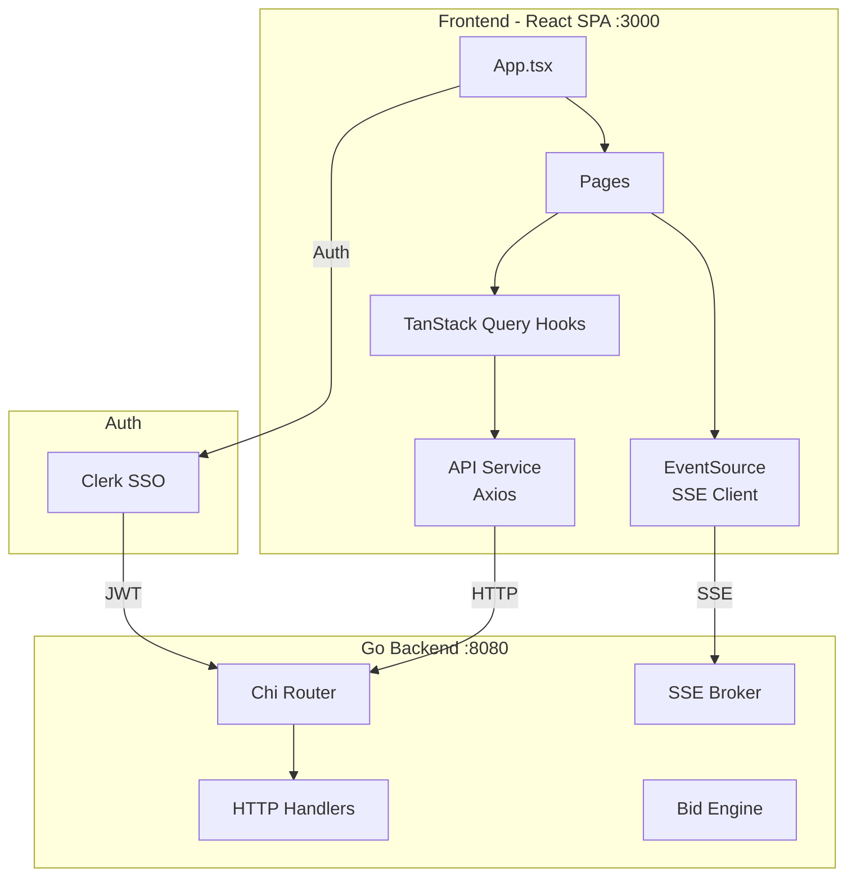
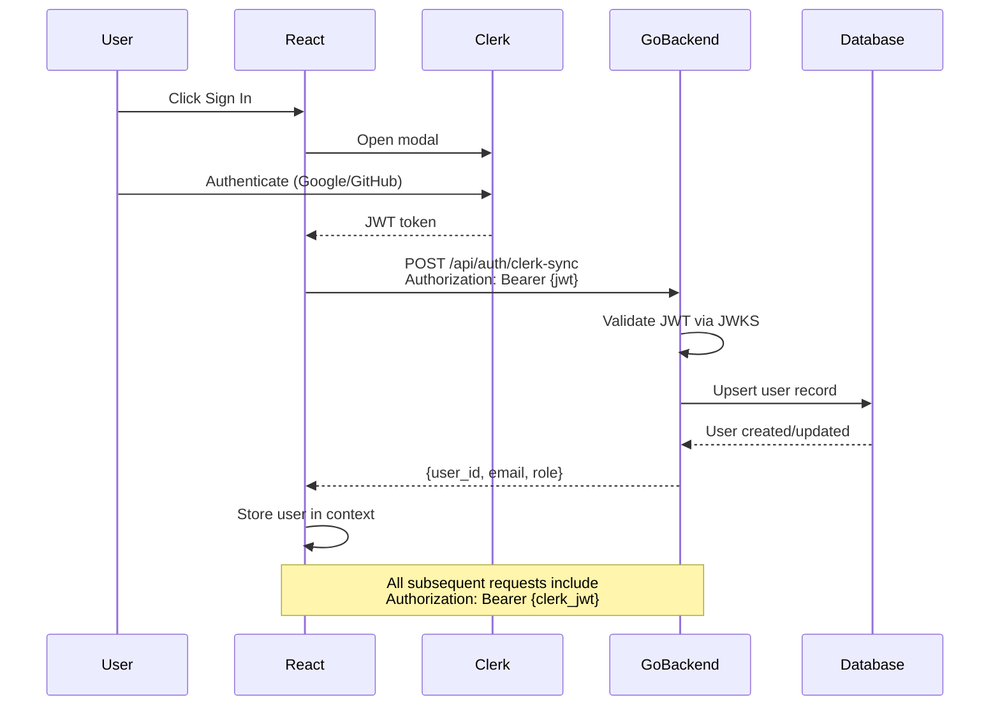
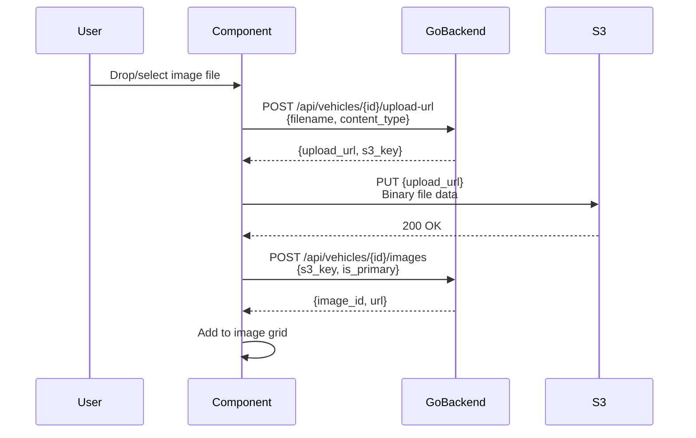

# Frontend Onboarding Guide

Welcome to the Vehicle Auction Platform frontend! This guide will get you up to speed quickly.

---

## Quick Start

```bash
cd frontend

# Install dependencies
npm install

# Start dev server (port 3000)
npm run dev
```

**Verify it's working:** Open http://localhost:3000

> **Note:** The Go backend must be running on port 8080 for API calls to work.
> ```bash
> # In project root
> make docker-up  # Start PostgreSQL, Redis, Jaeger
> make migrate    # Run migrations
> make run        # Start backend on :8080
> ```

---

## Tech Stack

| Technology | Purpose |
|------------|---------|
| **React 18** | UI framework |
| **TypeScript** | Type safety |
| **Vite** | Build tool & dev server |
| **Tailwind CSS v4** | Utility-first styling |
| **shadcn/ui** | Pre-built accessible components |
| **React Router** | Client-side routing |
| **TanStack Query** | Server state management & caching |
| **React Hook Form + Zod** | Form handling & validation |
| **Axios** | HTTP client |
| **Clerk** | Authentication (SSO) |
| **Lucide React** | Icons |

---

## Directory Structure

```
frontend/src/
├── main.tsx                 # Entry point
├── App.tsx                  # Routes + providers
├── index.css                # Tailwind CSS
│
├── components/
│   ├── ui/                  # shadcn/ui components
│   │   ├── button.tsx
│   │   ├── card.tsx
│   │   ├── input.tsx
│   │   └── ...
│   ├── Layout.tsx           # App layout with nav
│   └── ImageUpload.tsx      # Drag-and-drop S3 upload
│
├── pages/
│   ├── HomePage.tsx
│   ├── VehiclesPage.tsx     # Inventory grid + filters
│   ├── VehicleDetailPage.tsx
│   ├── VehicleCreatePage.tsx
│   ├── AuctionsPage.tsx
│   ├── AuctionDetailPage.tsx
│   └── DashboardPage.tsx
│
├── hooks/
│   ├── index.ts             # Exports all hooks
│   ├── useVehicles.ts       # List + filter vehicles
│   ├── useVehicle.ts        # Single vehicle fetch
│   └── useAuth.ts           # Clerk auth sync
│
├── services/
│   └── api.ts               # Axios client + API functions
│
├── types/
│   ├── index.ts             # Exports all types
│   ├── vehicle.ts           # Vehicle interfaces
│   └── form.ts              # Zod form schemas
│
└── lib/
    └── utils.ts             # Utility functions (cn, etc.)
```

---

## Architecture Overview



---

## Key Concepts

### 1. Component Library (shadcn/ui)

We use **shadcn/ui** — copy-paste components built on Radix UI + Tailwind.

```tsx
import { Button } from '@/components/ui/button';
import { Card, CardHeader, CardTitle, CardContent } from '@/components/ui/card';
import { Input } from '@/components/ui/input';

function Example() {
  return (
    <Card>
      <CardHeader>
        <CardTitle>Hello</CardTitle>
      </CardHeader>
      <CardContent>
        <Input placeholder="Type here..." />
        <Button>Submit</Button>
      </CardContent>
    </Card>
  );
}
```

**Adding new components:**
```bash
npx shadcn@latest add dialog
npx shadcn@latest add dropdown-menu
```

### 2. Routing (React Router)

Routes are defined in `App.tsx`:

```tsx
<Routes>
  <Route path="/" element={<HomePage />} />
  <Route path="/vehicles" element={<VehiclesPage />} />
  <Route path="/vehicles/:id" element={<VehicleDetailPage />} />
  <Route path="/vehicles/new" element={<VehicleCreatePage />} />
  <Route path="/auctions" element={<AuctionsPage />} />
  <Route path="/auctions/:id" element={<AuctionDetailPage />} />
</Routes>
```

**Navigation:**
```tsx
import { Link, useNavigate } from 'react-router-dom';

// Declarative
<Link to="/vehicles/123">View Vehicle</Link>

// Programmatic
const navigate = useNavigate();
navigate('/vehicles');
```

### 3. Data Fetching (TanStack Query)

We use TanStack Query for server state:

```tsx
import { useQuery, useMutation, useQueryClient } from '@tanstack/react-query';
import { vehiclesApi } from '@/services/api';

// Fetching data
function VehicleDetail({ id }: { id: number }) {
  const { data, isLoading, error } = useQuery({
    queryKey: ['vehicle', id],
    queryFn: () => vehiclesApi.getById(id),
  });

  if (isLoading) return <div>Loading...</div>;
  if (error) return <div>Error loading vehicle</div>;
  
  return <div>{data.make} {data.model}</div>;
}

// Mutating data
function CreateVehicle() {
  const queryClient = useQueryClient();
  
  const mutation = useMutation({
    mutationFn: vehiclesApi.create,
    onSuccess: () => {
      queryClient.invalidateQueries({ queryKey: ['vehicles'] });
    },
  });

  const handleSubmit = (data) => {
    mutation.mutate(data);
  };
}
```

### 4. Forms (React Hook Form + Zod)

Forms use React Hook Form with Zod validation:

```tsx
import { useForm } from 'react-hook-form';
import { zodResolver } from '@hookform/resolvers/zod';
import { z } from 'zod';

// Define schema
const schema = z.object({
  make: z.string().min(1, 'Make is required'),
  model: z.string().min(1, 'Model is required'),
  year: z.coerce.number().min(1900).max(2030),
  price: z.coerce.number().positive(),
});

type FormData = z.infer<typeof schema>;

// Use in component
function VehicleForm() {
  const { register, handleSubmit, formState: { errors } } = useForm<FormData>({
    resolver: zodResolver(schema),
  });

  const onSubmit = (data: FormData) => {
    console.log(data);
  };

  return (
    <form onSubmit={handleSubmit(onSubmit)}>
      <Input {...register('make')} placeholder="Make" />
      {errors.make && <span>{errors.make.message}</span>}
      
      <Input {...register('year')} type="number" placeholder="Year" />
      {errors.year && <span>{errors.year.message}</span>}
      
      <Button type="submit">Submit</Button>
    </form>
  );
}
```

### 5. Authentication (Clerk)

We use Clerk for SSO, synced to the Go backend:

```tsx
import { useAuth } from '@/hooks';
import { SignInButton, UserButton } from '@clerk/clerk-react';

function Header() {
  const { isSignedIn, isLoaded } = useAuth();

  if (!isLoaded) return null;

  return (
    <nav>
      {isSignedIn ? (
        <UserButton />
      ) : (
        <SignInButton mode="modal">
          <Button>Sign In</Button>
        </SignInButton>
      )}
    </nav>
  );
}
```

**Auth flow:**



### 6. Real-time Updates (SSE)

For auction pages, we use Server-Sent Events:

```tsx
import { useEffect, useState } from 'react';

function AuctionDetail({ auctionId }: { auctionId: number }) {
  const [currentBid, setCurrentBid] = useState(0);
  const [bidCount, setBidCount] = useState(0);

  useEffect(() => {
    const eventSource = new EventSource(`/api/auctions/${auctionId}/stream`);

    eventSource.addEventListener('bid_accepted', (e) => {
      const data = JSON.parse(e.data);
      setCurrentBid(data.amount);
      setBidCount(data.bid_count);
    });

    eventSource.addEventListener('auction_extended', (e) => {
      const data = JSON.parse(e.data);
      // Update end time, show snipe alert
    });

    eventSource.onerror = () => {
      console.error('SSE connection error');
      eventSource.close();
    };

    return () => eventSource.close();
  }, [auctionId]);

  return (
    <div>
      <p>Current Bid: ${currentBid}</p>
      <p>Total Bids: {bidCount}</p>
    </div>
  );
}
```

### 7. Placing Bids

Bids are asynchronous — you get a ticket ID immediately:

```tsx
async function placeBid(auctionId: number, amount: number) {
  // Submit bid
  const response = await api.post(`/auctions/${auctionId}/bids`, { amount });
  
  // Response is 202 Accepted with ticket
  const { ticket_id, status } = response.data;
  // status = "queued"
  
  // Option 1: Wait for SSE event (recommended)
  // The SSE stream will receive bid_accepted or bid_rejected
  
  // Option 2: Poll for result
  const result = await api.get(`/bids/${ticket_id}/status`);
  // result.status = "accepted" | "rejected" | "processing"
}
```

### 8. API Client

All API calls go through `services/api.ts`:

```tsx
import axios from 'axios';
import { useAuth } from '@clerk/clerk-react';

// Create axios instance
const api = axios.create({
  baseURL: '/api',  // Proxied to localhost:8080 by Vite
});

// Add auth token to requests
api.interceptors.request.use(async (config) => {
  const token = await getToken();  // From Clerk
  if (token) {
    config.headers.Authorization = `Bearer ${token}`;
  }
  return config;
});

// API functions
export const vehiclesApi = {
  getAll: async (filters?: VehicleFilters) => {
    const { data } = await api.get('/vehicles', { params: filters });
    return data;
  },
  
  getById: async (id: number) => {
    const { data } = await api.get(`/vehicles/${id}`);
    return data;
  },
  
  create: async (payload: CreateVehicle) => {
    const { data } = await api.post('/vehicles', payload);
    return data;
  },
};

export const auctionsApi = {
  getAll: async () => {
    const { data } = await api.get('/auctions');
    return data;
  },
  
  placeBid: async (auctionId: number, amount: number) => {
    const { data } = await api.post(`/auctions/${auctionId}/bids`, { amount });
    return data;  // { ticket_id, status }
  },
};
```

---

## Common Tasks

### Adding a New Page

1. **Create the page** in `pages/`:
```tsx
// pages/MyNewPage.tsx
export function MyNewPage() {
  return (
    <div className="container mx-auto py-8">
      <h1 className="text-3xl font-bold">My New Page</h1>
    </div>
  );
}
```

2. **Add the route** in `App.tsx`:
```tsx
import { MyNewPage } from '@/pages/MyNewPage';

<Route path="/my-new-page" element={<MyNewPage />} />
```

3. **Add nav link** in `Layout.tsx` (if needed).

### Adding a New Hook

1. **Create the hook** in `hooks/`:
```tsx
// hooks/useMyData.ts
import { useQuery } from '@tanstack/react-query';
import { api } from '@/services/api';

export function useMyData(id: number) {
  return useQuery({
    queryKey: ['myData', id],
    queryFn: async () => {
      const { data } = await api.get(`/my-endpoint/${id}`);
      return data;
    },
  });
}
```

2. **Export it** in `hooks/index.ts`:
```tsx
export { useMyData } from './useMyData';
```

---

## Styling with Tailwind

### Basic Usage

```tsx
<div className="flex items-center gap-4 p-4 bg-white rounded-lg shadow">
  <span className="text-lg font-semibold text-gray-900">Title</span>
  <span className="text-sm text-gray-500">Subtitle</span>
</div>
```

### Common Patterns

```tsx
// Responsive
<div className="grid grid-cols-1 md:grid-cols-2 lg:grid-cols-3 gap-4">

// Hover/Focus states
<button className="bg-blue-500 hover:bg-blue-600 focus:ring-2">

// Conditional classes (use cn utility)
import { cn } from '@/lib/utils';

<div className={cn(
  "p-4 rounded",
  isActive && "bg-blue-100",
  isError && "border-red-500"
)}>
```

---

## File Upload Pattern

The `ImageUpload` component handles S3 uploads:

```tsx
import { ImageUpload } from '@/components/ImageUpload';

function VehicleForm({ vehicleId }: { vehicleId: number }) {
  const [images, setImages] = useState([]);

  return (
    <ImageUpload
      vehicleId={vehicleId}
      images={images}
      onImagesChange={setImages}
      maxImages={20}
    />
  );
}
```

**How it works:**



---

## Development Tips

### Hot Module Replacement

Vite provides instant updates. Just save a file and see changes immediately.

### React DevTools

Install the React DevTools browser extension to inspect component state.

### Network Tab

Use browser DevTools Network tab to debug API calls.

### Console Errors

Check browser console for React errors and API failures.

---

## Common Issues

| Issue | Solution |
|-------|----------|
| `CORS error` | Backend not running on port 8080 |
| `401 Unauthorized` | Not signed in, or Clerk JWT expired |
| `502 Bad Gateway` | Backend crashed, check `make run` terminal |
| `Module not found` | Check import path, use `@/` alias |
| Styles not applying | Check Tailwind class names |
| Form not submitting | Check Zod validation errors |
| SSE not connecting | Check `/api/auctions/{id}/stream` endpoint |

---

## Build for Production

```bash
npm run build
```

Creates optimized static files in `dist/`:
- `index.html`
- `assets/index-xxx.js` (minified JS)
- `assets/index-xxx.css` (minified CSS)

Deploy `dist/` to any static host (Netlify, Vercel, S3, etc.).

---

## Questions?

- Check existing pages for patterns (especially `AuctionDetailPage.tsx`)
- Look at `services/api.ts` for API call examples
- Check the main [README.md](../README.md) for backend API reference
- Run `npm run dev` and experiment!
